# HTA: Suchaktion erstellen

**Akteur:** Haustierbesitzer  
**Kontext:** Tier ist vermisst, Benutzer möchte eine Suchaktion starten  
**Version:** 1.0  
**Datum:** 2025-01-26

---

## Aufgaben-Hierarchie

```mermaid
graph TD
    A[Suchaktion erstellen] --> B[1. System öffnen]
    A --> C[2. Registrierung/Anmeldung]
    A --> D[3. Suchaktion initialisieren]
    A --> E[4. Haustier-Informationen eingeben]
    A --> F[5. Bereiche markieren]
    A --> G[6. Einstellungen konfigurieren]
    A --> H[7. Suchaktion veröffentlichen]
    
    B --> B1[Website öffnen]
    B --> B2[Laden der Startseite abwarten]
    
    C --> C1{Account vorhanden?}
    C1 -->|Ja| C2[Anmelden]
    C1 -->|Nein| C3[Registrieren]
    C3 --> C3a[E-Mail eingeben]
    C3 --> C3b[Passwort erstellen]
    C3 --> C3c[Bestätigung per E-Mail]
    C2 --> C2a[E-Mail eingeben]
    C2 --> C2b[Passwort eingeben]
    C2 --> C2c[Anmelden klicken]
    
    D --> D1[Button 'Neue Suchaktion' klicken]
    D --> D2[Formular öffnet sich]
    
    E --> E1[Haustier-Name eingeben]
    E --> E2[Haustier-Typ auswählen]
    E --> E3[Beschreibung eingeben]
    E --> E4[Foto hochladen]
    E --> E5[Vermisst seit Datum]
    E --> E6[Kontaktinformationen]
    
    F --> F1[Karte öffnen]
    F --> F2[Gebiete auf Karte markieren]
    F --> F3[Prioritäten zuweisen]
    F --> F4[Beschreibungen zu Gebieten hinzufügen]
    
    G --> G1{Öffentlich machen?}
    G1 -->|Ja| G2[Öffentlichkeits-Option aktivieren]
    G1 -->|Nein| G3[Privat halten]
    G --> G4[Benachrichtigungen aktivieren]
    
    H --> H1[Vorschau prüfen]
    H --> H2[Speichern klicken]
    H --> H3[Bestätigung abwarten]
    H --> H4[Suchaktion ist aktiv]
    
    style A fill:#4a90e2,stroke:#2c5aa0,stroke-width:3px,color:#fff
    style D fill:#51cf66,stroke:#37b24d,stroke-width:2px
    style E fill:#51cf66,stroke:#37b24d,stroke-width:2px
    style F fill:#51cf66,stroke:#37b24d,stroke-width:2px
    style H fill:#ff6b6b,stroke:#d63031,stroke-width:2px,color:#fff
```

---

## Detaillierte Schritte

### 1. System öffnen
- **1.1** Website öffnen (Browser)
- **1.2** Laden der Startseite abwarten

### 2. Registrierung/Anmeldung
- **2.1** Entscheiden: Account vorhanden?
  - **2.1.1** Falls Ja: Anmelden
    - E-Mail eingeben
    - Passwort eingeben
    - "Anmelden" klicken
  - **2.1.2** Falls Nein: Registrieren
    - "Registrieren" klicken
    - E-Mail-Adresse eingeben
    - Passwort erstellen (mind. 8 Zeichen)
    - Passwort bestätigen
    - "Registrieren" klicken
    - Bestätigungs-E-Mail öffnen und Link klicken

### 3. Suchaktion initialisieren
- **3.1** Button "Neue Suchaktion" finden und klicken
- **3.2** Formular öffnet sich
- **3.3** Übersicht über benötigte Informationen erhalten

### 4. Haustier-Informationen eingeben
- **4.1** Haustier-Name eingeben (z.B. "Mika")
- **4.2** Haustier-Typ auswählen (Katze, Hund, etc.)
- **4.3** Beschreibung eingeben
  - Rasse (optional)
  - Farbe
  - Besondere Merkmale
  - Größe/Gewicht
- **4.4** Foto hochladen
  - Datei auswählen
  - Upload abwarten
  - Vorschau prüfen
- **4.5** "Vermisst seit" Datum auswählen
- **4.6** Kontaktinformationen eingeben/überprüfen

### 5. Bereiche markieren
- **5.1** Karte öffnen (automatisch oder Button klicken)
- **5.2** Gebiete auf Karte markieren
  - Polygon-Tool wählen
  - Auf Karte klicken, um Gebiet zu umranden
  - Doppelklick zum Abschließen
- **5.3** Prioritäten zuweisen (Hoch, Mittel, Niedrig)
- **5.4** Beschreibungen zu Gebieten hinzufügen
  - Warum wichtig?
  - Bekannte Aufenthaltsorte?
  - Besondere Hinweise

### 6. Einstellungen konfigurieren
- **6.1** Entscheiden: Öffentlich machen?
  - **6.1.1** Falls Ja: Option "Öffentlich" aktivieren
  - **6.1.2** Falls Nein: Privat halten (nur eingeladene Helfer)
- **6.2** Benachrichtigungen aktivieren/deaktivieren
- **6.3** Weitere Einstellungen prüfen

### 7. Suchaktion veröffentlichen
- **7.1** Vorschau prüfen
  - Alle Informationen korrekt?
  - Bereiche korrekt markiert?
- **7.2** "Suchaktion erstellen" klicken
- **7.3** Bestätigung abwarten
- **7.4** Suchaktion ist nun aktiv
- **7.5** Nächste Schritte werden angezeigt (z.B. "Helfer einladen")

---

## Fehlerbehandlung

| Fehler | Ursache | Lösung |
|--------|---------|--------|
| Anmeldung fehlgeschlagen | Falsche Zugangsdaten | Passwort zurücksetzen oder erneut versuchen |
| Karte lädt nicht | Internetverbindung | Verbindung prüfen, Seite neu laden |
| Foto-Upload fehlgeschlagen | Datei zu groß/Falsches Format | Datei komprimieren oder anderes Format wählen |
| Gebiet kann nicht markiert werden | Browser-Kompatibilität | Anderen Browser verwenden |
| Speichern fehlgeschlagen | Validierungsfehler | Fehlende Pflichtfelder ausfüllen |

---

## Varianten

- **Schnell-Erstellung:** Minimale Informationen, später ergänzen
- **Ausführliche Erstellung:** Alle Details sofort ausfüllen
- **Mit Vorlage:** Vorherige Suchaktion als Vorlage nutzen

## Zeitschätzung

- **Minimal:** 5-10 Minuten (nur Pflichtfelder)
- **Standard:** 15-20 Minuten (mit Bereichen und Details)
- **Ausführlich:** 25-30 Minuten (mit allen Optionen)