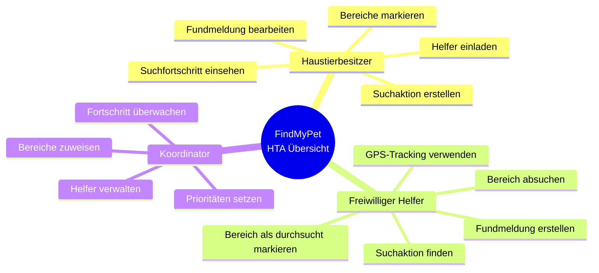
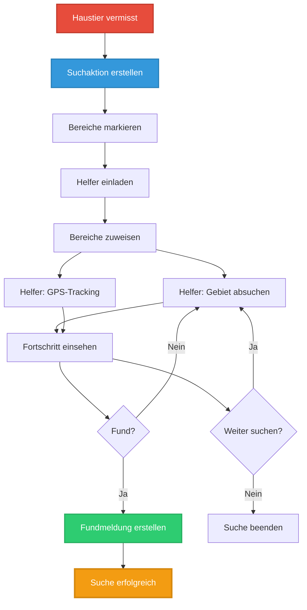
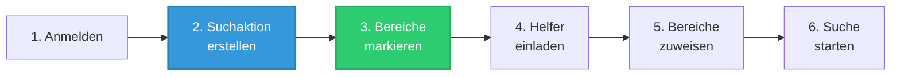
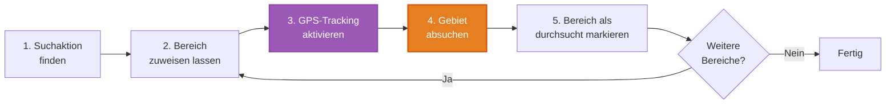
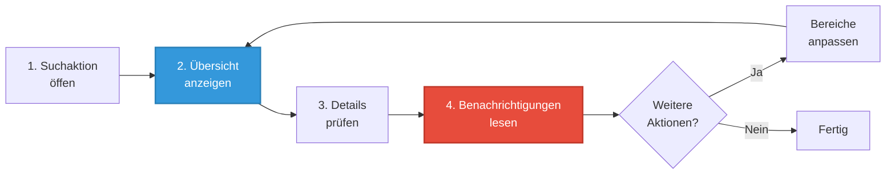

# HTA Gesamtübersicht FindMyPet V2.0

**Version:** 2.0  
**Datum:** 2025-01-26  
**Status:** Vollständig & Detailliert

---

## Überblick

Diese Dokumentation stellt eine vollständige Übersicht über alle Hierarchischen Aufgabenanalysen (HTAs) für das FindMyPet-System dar. Die HTAs beschreiben detailliert die Aufgaben und Schritte, die verschiedene Akteure bei der Nutzung des Systems durchführen.

---

## HTA-Übersicht nach Akteur

---

## Vollständige HTA-Liste

### Haustierbesitzer / Koordinator

#### 1. [HTA: Suchaktion erstellen](Einzelne%20HTA/HTA%20Suchaktion%20erstellen.md)
**Zweck:** Neue Suchaktion für vermisstes Haustier erstellen  
**Schwierigkeit:** Mittel  
**Zeitaufwand:** 15-30 Minuten  
**Status:** ✅ Erstellt

**Hauptaufgaben:**
- System öffnen
- Registrierung/Anmeldung
- Suchaktion initialisieren
- Haustier-Informationen eingeben
- Bereiche markieren
- Einstellungen konfigurieren
- Suchaktion veröffentlichen

---

#### 2. [HTA: Bereiche markieren](Einzelne%20HTA/HTA%20Bereiche%20markieren.md)
**Zweck:** Suchgebiete auf Karte markieren und beschreiben  
**Schwierigkeit:** Mittel  
**Zeitaufwand:** 2-10 Minuten pro Gebiet  
**Status:** ✅ Erstellt

**Hauptaufgaben:**
- Kartenansicht öffnen
- Markierungsmodus aktivieren
- Gebiet auf Karte markieren
- Gebiet bearbeiten (optional)
- Gebiet-Informationen hinzufügen
- Speichern

---

#### 3. [HTA: Helfer der Suche hinzufügen](Einzelne%20HTA/HTA%20Helfer%20der%20Suche%20Hinzufügen.pdf)
**Zweck:** Personen zur Suchaktion einladen  
**Schwierigkeit:** Niedrig  
**Zeitaufwand:** 2-5 Minuten  
**Status:** ✅ Vorhanden (PDF)

**Hauptaufgaben:**
- Helfer-Liste öffnen
- Einladung erstellen
- Kontakt auswählen
- Einladung senden
- Bereiche zuweisen (optional)

---

#### 4. [HTA: Suchfortschritt einsehen](Einzelne%20HTA/HTA%20Suchfortschritt%20einsehen.md)
**Zweck:** Status und Fortschritt der Suche überwachen  
**Schwierigkeit:** Niedrig  
**Zeitaufwand:** 1-15 Minuten  
**Status:** ✅ Erstellt

**Hauptaufgaben:**
- Suchaktion öffnen
- Übersicht anzeigen
- Detaillierte Informationen prüfen
- Filter und Sortierung nutzen
- Benachrichtigungen prüfen

---

### Freiwilliger Helfer

#### 5. [HTA: Gebiet absuchen](Einzelne%20HTA/HTA%20Gebiet%20absuchen.pdf)
**Zweck:** Zugewiesenes Gebiet physisch durchsuchen  
**Schwierigkeit:** Mittel  
**Zeitaufwand:** 30 Minuten - mehrere Stunden  
**Status:** ✅ Vorhanden (PDF)

**Hauptaufgaben:**
- Zugewiesenes Gebiet identifizieren
- Zum Gebiet begeben
- Systematisch durchsuchen
- Fundmeldung erstellen (falls Tier gefunden)
- Bereich als durchsucht markieren

---

#### 6. [HTA: GPS-Tracking verwenden](Einzelne%20HTA/HTA%20GPS%20Tracking%20verwenden.md)
**Zweck:** Automatische Erfassung des Suchwegs  
**Schwierigkeit:** Niedrig  
**Zeitaufwand:** Setup 1-2 Min, dann kontinuierlich  
**Status:** ✅ Erstellt

**Hauptaufgaben:**
- Suchaktion öffnen
- GPS-Berechtigung erteilen
- Tracking aktivieren
- Tracking während Suche
- Tracking pausieren/deaktivieren
- Route ansehen

---

#### 7. [HTA: Fundmeldung erstellen](Einzelne%20HTA/HTA%20Fundmeldung%20erstellen.md)
**Zweck:** Meldung erstellen, wenn Tier gefunden wurde  
**Schwierigkeit:** Niedrig-Mittel  
**Zeitaufwand:** 2-15 Minuten  
**Status:** ✅ Erstellt

**Hauptaufgaben:**
- Fund-Situation erkennen
- Fundmeldung öffnen
- Fund-Informationen eingeben
- Position markieren
- Kontakt herstellen
- Fundmeldung absenden

---

## HTA-Beziehungsdiagramm

---

## Aufgaben-Matrix

| Aufgabe | Akteur | Priorität | Häufigkeit | Schwierigkeit |
|---------|--------|-----------|------------|---------------|
| Suchaktion erstellen | Haustierbesitzer | Hoch | Einmalig | Mittel |
| Bereiche markieren | Haustierbesitzer | Hoch | Mehrmals | Mittel |
| Helfer hinzufügen | Koordinator | Mittel | Mehrmals | Niedrig |
| Gebiet absuchen | Freiwilliger | Hoch | Mehrmals | Mittel |
| GPS-Tracking verwenden | Freiwilliger | Mittel | Oft | Niedrig |
| Fundmeldung erstellen | Finder | Hoch | Selten | Niedrig-Mittel |
| Fortschritt einsehen | Alle | Mittel | Oft | Niedrig |

---

## Workflow-Übersicht

### Workflow 1: Neue Suchaktion starten

### Workflow 2: Als Helfer suchen

### Workflow 3: Fortschritt überwachen

---

## Verbesserungen in V2.0

### Neu erstellte HTAs:
✅ **HTA: Suchaktion erstellen** - Detaillierte Anleitung für die wichtigste Aufgabe  
✅ **HTA: Bereiche markieren** - Umfassende Beschreibung der Bereichsmarkierung  
✅ **HTA: GPS-Tracking verwenden** - Komplette Anleitung für GPS-Funktionalität  
✅ **HTA: Fundmeldung erstellen** - Schritt-für-Schritt Anleitung für Fundmeldungen  
✅ **HTA: Suchfortschritt einsehen** - Detaillierte Übersicht über Fortschritts-Anzeige

### Verbesserungen:
✅ **Mermaid-Diagramme:** Alle HTAs enthalten visuelle Hierarchie-Diagramme  
✅ **Detaillierte Schritte:** Jede Aufgabe ist in Unteraufgaben zerlegt  
✅ **Fehlerbehandlung:** Häufige Fehler und Lösungen dokumentiert  
✅ **Best Practices:** Tipps für effiziente Nutzung  
✅ **Zeitschätzungen:** Realistische Zeitangaben für Planung  
✅ **Varianten:** Verschiedene Nutzungsmöglichkeiten dokumentiert

---

## Dokumentations-Standard

Alle HTAs folgen einem einheitlichen Format:

1. **Kopfzeile:**
   - Akteur
   - Kontext
   - Version
   - Datum

2. **Aufgaben-Hierarchie:**
   - Mermaid-Diagramm
   - Visuelle Darstellung

3. **Detaillierte Schritte:**
   - Nummerierte Schritte
   - Unteraufgaben
   - Entscheidungspunkte

4. **Zusätzliche Informationen:**
   - Werkzeuge & Funktionen
   - Best Practices
   - Fehlerbehandlung
   - Erfolgskriterien
   - Varianten
   - Zeitschätzungen

---

## Navigation

- [HTA: Suchaktion erstellen](Einzelne%20HTA/HTA%20Suchaktion%20erstellen.md)
- [HTA: Bereiche markieren](Einzelne%20HTA/HTA%20Bereiche%20markieren.md)
- [HTA: Helfer hinzufügen](Einzelne%20HTA/HTA%20Helfer%20der%20Suche%20Hinzufügen.pdf)
- [HTA: Gebiet absuchen](Einzelne%20HTA/HTA%20Gebiet%20absuchen.pdf)
- [HTA: GPS-Tracking verwenden](Einzelne%20HTA/HTA%20GPS%20Tracking%20verwenden.md)
- [HTA: Fundmeldung erstellen](Einzelne%20HTA/HTA%20Fundmeldung%20erstellen.md)
- [HTA: Suchfortschritt einsehen](Einzelne%20HTA/HTA%20Suchfortschritt%20einsehen.md)

---

## Anmerkungen

- Diese Dokumentation wird kontinuierlich erweitert
- HTAs werden bei Systemänderungen aktualisiert
- Feedback und Verbesserungsvorschläge sind willkommen
- Für Fragen oder Unklarheiten: Siehe User Stories oder Szenario

---

**Erstellt von:** Team Axt · Moujtahid · Havertz  
**Letzte Aktualisierung:** 2025-01-26

