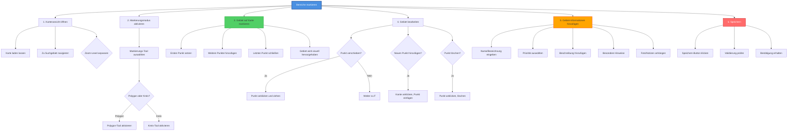

# HTA: Bereiche auf Karte markieren

**Akteur:** Haustierbesitzer / Koordinator  
**Kontext:** Während oder nach der Erstellung einer Suchaktion  
**Version:** 1.0  
**Datum:** 2025-01-26

---

## Aufgaben-Hierarchie

---

## Detaillierte Schritte

### 1. Kartenansicht öffnen
- **1.1** Karte lädt automatisch oder per Button-Klick
- **1.2** Zum gewünschten Suchgebiet navigieren
  - Karte verschieben (Maus/Touch)
  - Adresse suchen (optional)
- **1.3** Zoom-Level anpassen
  - Reinzoomen für detaillierte Markierung
  - Rauszoomen für Übersicht

### 2. Markierungsmodus aktivieren
- **2.1** Markierungs-Tool auswählen
  - Button "Bereich markieren" klicken
  - Toolbar wird sichtbar
- **2.2** Form auswählen
  - **Polygon:** Für unregelmäßige Gebiete
  - **Kreis:** Für runde Gebiete
  - **Rechteck:** Für rechteckige Gebiete

### 3. Gebiet auf Karte markieren

#### Polygon-Methode:
- **3.1** Ersten Punkt setzen (Klick auf Karte)
- **3.2** Weitere Punkte hinzufügen
  - Um Gebiet herum klicken
  - Jeder Klick fügt einen Punkt hinzu
- **3.3** Letzten Punkt schließen
  - Doppelklick oder
  - Ersten Punkt erneut anklicken
- **3.4** Gebiet wird visuell hervorgehoben (Farbe/Füllung)

#### Kreis-Methode:
- **3.1** Zentrum des Kreises anklicken
- **3.2** Maus/Touch gedrückt halten
- **3.3** Radius durch Ziehen anpassen
- **3.4** Loslassen, Kreis wird erstellt

### 4. Gebiet bearbeiten (optional)
- **4.1** Punkt verschieben
  - Punkt anklicken
  - An neue Position ziehen
- **4.2** Neuen Punkt hinzufügen
  - Kante zwischen zwei Punkten anklicken
  - Neuer Punkt wird eingefügt
- **4.3** Punkt löschen
  - Punkt anklicken
  - "Löschen" Button klicken oder Entf-Taste
- **4.4** Gesamtes Gebiet löschen
  - "Gebiet löschen" Button klicken
  - Bestätigen

### 5. Gebiet-Informationen hinzufügen
- **5.1** Name/Bezeichnung eingeben
  - z.B. "Park", "Nachbars Garten", "Waldstück"
- **5.2** Priorität auswählen
  - **Hoch:** Bekannte Aufenthaltsorte, häufige Plätze
  - **Mittel:** Mögliche Aufenthaltsorte
  - **Niedrig:** Unwahrscheinlich, aber sicherheitshalber
- **5.3** Beschreibung hinzufügen
  - Warum ist dieser Bereich wichtig?
  - Wann wurde das Tier hier zuletzt gesehen?
  - Besondere Gegebenheiten (z.B. Verstecke)
- **5.4** Besondere Hinweise
  - Zugangsbeschränkungen
  - Gefahrenstellen
  - Tipps für Sucher
- **5.5** Optional: Foto/Notizen anhängen
  - Foto des Gebiets hochladen
  - Weitere Notizen als Text

### 6. Speichern
- **6.1** "Bereich speichern" Button klicken
- **6.2** Validierung prüfen
  - Mindestgröße eingehalten?
  - Pflichtfelder ausgefüllt?
- **6.3** Bestätigung erhalten
  - Erfolgsmeldung wird angezeigt
  - Gebiet erscheint in der Übersicht
- **6.4** Weitere Bereiche markieren (optional)
  - Zurück zu Schritt 2

---

## Werkzeuge & Funktionen

| Werkzeug | Beschreibung | Anwendungsfall |
|----------|--------------|----------------|
| **Polygon** | Freihand-Form | Unregelmäßige Gebiete, Gärten, Parks |
| **Kreis** | Runde Form | Runde Gebiete, Radius um Punkt |
| **Rechteck** | Rechteckige Form | Quadratische/Rechteckige Gebiete |
| **Bearbeiten** | Punkte anpassen | Feinkorrektur nach Erstellung |
| **Löschen** | Gebiet entfernen | Falsche Markierung korrigieren |

---

## Best Practices

✅ **Präzision:** Genau markieren, aber nicht zu klein  
✅ **Übersichtlichkeit:** Gebiete sollten sich nicht zu sehr überlappen  
✅ **Priorisierung:** Wichtige Gebiete deutlich markieren  
✅ **Beschreibungen:** Konkrete Hinweise helfen Suchern  
✅ **Regelmäßige Updates:** Bereiche bei Bedarf anpassen

---

## Fehlerbehandlung

| Fehler | Ursache | Lösung |
|--------|---------|--------|
| Punkt kann nicht gesetzt werden | Karte nicht geladen | Seite neu laden |
| Gebiet zu klein | Mindestgröße unterschritten | Gebiet vergrößern |
| Gebiet kann nicht gespeichert werden | Pflichtfelder fehlen | Informationen ergänzen |
| Markierung verschwindet | Browser-Fehler | Seite neu laden, erneut markieren |
| Karte reagiert nicht | Touch/Maus-Problem | Browser neu starten |

---

## Varianten

- **Schnelle Markierung:** Nur Umriss, Details später
- **Detaillierte Markierung:** Alle Informationen sofort
- **Bulk-Markierung:** Mehrere Gebiete hintereinander
- **Import:** Koordinaten aus anderer Quelle importieren

## Zeitschätzung

- **Einfaches Gebiet:** 2-3 Minuten
- **Komplexes Gebiet (mit Bearbeitung):** 5-7 Minuten
- **Mit allen Details:** 8-10 Minuten