# HTA: Fundmeldung erstellen

**Akteur:** Freiwilliger Helfer / Finder  
**Kontext:** Tier wurde gefunden, Meldung muss erstellt werden  
**Version:** 1.0  
**Datum:** 2025-01-26

---

## Aufgaben-Hierarchie

```mermaid
graph TD
    A[Fundmeldung erstellen] --> B[1. Fund-Situation erkennen]
    A --> C[2. Fundmeldung öffnen]
    A --> D[3. Fund-Informationen eingeben]
    A --> E[4. Position markieren]
    A --> F[5. Kontakt herstellen]
    A --> G[6. Fundmeldung absenden]
    
    B --> B1[Tier wurde gefunden]
    B --> B2[Suchaktion identifizieren]
    B --> B3{In Suchaktion eingeloggt?}
    
    C --> C1[Fundmeldung-Button finden]
    C --> C2[Formular öffnet sich]
    C --> C3[Fundmeldung-Typ wählen]
    
    D --> D1[Fund-Datum/Zeit eingeben]
    D --> D2[Fund-Ort beschreiben]
    D --> D3[Zustand des Tieres]
    D --> D4[Foto hochladen optional]
    D --> D5[Weitere Beobachtungen]
    
    E --> E1[GPS-Position erfassen]
    E --> E2[Oder manuell auf Karte markieren]
    E --> E3[Position prüfen]
    
    F --> F1{Kontaktinfo verfügbar?}
    F1 -->|Ja| F2[Kontaktinformationen anzeigen]
    F1 -->|Nein| F3[Fundmeldung als anonym senden]
    F --> F4[Optional: Direkt kontaktieren]
    
    G --> G1[Daten prüfen]
    G --> G2[Absenden-Button klicken]
    G --> G3[Bestätigung erhalten]
    G --> G4[Besitzer wird benachrichtigt]
    
    style A fill:#4a90e2,stroke:#2c5aa0,stroke-width:3px,color:#fff
    style D fill:#51cf66,stroke:#37b24d,stroke-width:2px
    style F fill:#ffa502,stroke:#ff6348,stroke-width:2px
    style G fill:#ff6b6b,stroke:#d63031,stroke-width:2px,color:#fff
```

---

## Detaillierte Schritte

### 1. Fund-Situation erkennen
- **1.1** Tier wurde gefunden
  - Während aktiver Suche
  - Oder zufälliger Fund
- **1.2** Suchaktion identifizieren
  - Welches Tier wurde gefunden?
  - Zu welcher Suchaktion gehört es?
- **1.3** In Suchaktion eingeloggt?
  - Falls ja: Direkt Fundmeldung erstellen
  - Falls nein: Suchaktion öffnen oder Link verwenden

### 2. Fundmeldung öffnen
- **2.1** Fundmeldung-Button finden
  - In Suchaktions-Details
  - Oder "Tier gefunden" Button
- **2.2** Formular öffnet sich
  - Fundmeldung-Maske erscheint
- **2.3** Fundmeldung-Typ wählen (optional)
  - **Vermuteter Fund:** Nicht sicher, ob es das gesuchte Tier ist
  - **Bestätigter Fund:** Sicher, dass es das gesuchte Tier ist
  - **Hinweis:** Nur Information, kein direkter Fund

### 3. Fund-Informationen eingeben
- **3.1** Fund-Datum/Zeit eingeben
  - Wann wurde das Tier gefunden?
  - Automatisch: Aktuelle Zeit vorausgefüllt
  - Manuell: Falls Fund früher erfolgte
- **3.2** Fund-Ort beschreiben
  - Genauer Standort (Straße, Hausnummer, etc.)
  - Besonderheiten des Ortes
  - Zugänglichkeit
- **3.3** Zustand des Tieres beschreiben
  - Gesund/Verletzt/Krank
  - Verhalten (ängstlich, freundlich, etc.)
  - Äußere Merkmale übereinstimmend?
- **3.4** Optional: Foto hochladen
  - Aktuelles Foto des Tieres
  - Vergleich mit Suchaktion möglich
- **3.5** Weitere Beobachtungen
  - Was war das Tier am Tun?
  - Wohin ist es gegangen?
  - Sonstige relevante Informationen

### 4. Position markieren
- **4.1** GPS-Position erfassen
  - "Aktuelle Position verwenden" klicken
  - GPS wird aktiviert
  - Position wird automatisch erfasst
- **4.2** Oder manuell auf Karte markieren
  - Karte öffnen
  - Punkt setzen an Fundstelle
  - Genauigkeit prüfen
- **4.3** Position prüfen
  - Ist die Position korrekt?
  - Falls nein: Position anpassen
  - Genauigkeit: Mindestens auf Haus-Niveau

### 5. Kontakt herstellen
- **5.1** Kontaktinformationen verfügbar?
  - System zeigt Kontaktdaten des Besitzers
  - Oder anonyme Kontaktmöglichkeit
- **5.2** Optionen wählen
  - **Direkt kontaktieren:** Telefon/Email sofort nutzen
  - **Über System:** Nachricht über System senden
  - **Anonym:** Fundmeldung senden, Kontakt später
- **5.3** Optional: Direkt kontaktieren
  - Telefonnummer anrufen
  - Oder E-Mail senden
  - Koordination des Abholens

### 6. Fundmeldung absenden
- **6.1** Daten prüfen
  - Alle Informationen korrekt?
  - Position stimmt?
  - Kontaktinformationen verfügbar?
- **6.2** "Fundmeldung senden" Button klicken
  - Oder "Absenden"
- **6.3** Bestätigung erhalten
  - "Fundmeldung wurde gesendet"
  - "Besitzer wurde benachrichtigt"
- **6.4** Besitzer wird benachrichtigt
  - Push-Benachrichtigung
  - E-Mail-Benachrichtigung
  - SMS (falls aktiviert)
- **6.5** Status-Updates erhalten
  - Wann wurde Meldung gelesen?
  - Wurde Kontakt hergestellt?
  - Wurde Tier abgeholt?

---

## Fundmeldung-Typen

| Typ | Beschreibung | Verwendung |
|-----|--------------|------------|
| **Bestätigter Fund** | Sicher, dass es das gesuchte Tier ist | Wenn 100% sicher |
| **Vermuteter Fund** | Könnte das gesuchte Tier sein | Bei Unsicherheit |
| **Hinweis** | Information über möglichen Fund | Wenn nicht vor Ort |

---

## Kontakt-Optionen

- **Direkter Kontakt:**
  - Telefonnummer anzeigen
  - E-Mail-Adresse anzeigen
  - Sofortige Kommunikation möglich
  
- **Über System:**
  - Nachricht über System senden
  - Anonyme Kommunikation
  - Datenschutz gewährleistet
  
- **Anonym:**
  - Nur Fundmeldung senden
  - Keine Kontaktdaten teilen
  - Besitzer kann Kontakt aufnehmen

---

## Best Practices

✅ **Schnell melden:** Sofort nach Fund melden  
✅ **Genau beschreiben:** Detaillierte Informationen helfen  
✅ **Foto hinzufügen:** Visueller Vergleich möglich  
✅ **Position genau:** Präzise Standortangabe  
✅ **Tier sichern:** Falls möglich, Tier am Ort halten

---

## Fehlerbehandlung

| Fehler | Ursache | Lösung |
|--------|---------|--------|
| Position kann nicht erfasst werden | GPS-Problem | Manuell auf Karte markieren |
| Foto-Upload fehlgeschlagen | Datei zu groß | Komprimieren oder später senden |
| Fundmeldung kann nicht gesendet werden | Internet-Problem | Offline speichern, später senden |
| Kontaktinformationen fehlen | Privacy-Einstellungen | Über System kontaktieren |

---

## Varianten

- **Schnell-Meldung:** Minimale Informationen, Details später
- **Detaillierte Meldung:** Alle Informationen sofort
- **Anonyme Meldung:** Ohne Kontaktdaten
- **Vermutete Meldung:** Bei Unsicherheit

## Zeitschätzung

- **Schnell:** 2-3 Minuten (Minimal-Informationen)
- **Standard:** 5-7 Minuten (Mit Foto und Details)
- **Ausführlich:** 10-15 Minuten (Mit Kontaktaufnahme)

