# HTA: GPS-Tracking verwenden

**Akteur:** Freiwilliger Helfer  
**Kontext:** Unterwegs während der Suche, automatische Erfassung des Suchwegs  
**Version:** 1.0  
**Datum:** 2025-01-26

---

## Aufgaben-Hierarchie

```mermaid
graph TD
    A[GPS-Tracking verwenden] --> B[1. Suchaktion öffnen]
    A --> C[2. GPS-Berechtigung erteilen]
    A --> D[3. Tracking aktivieren]
    A --> E[4. Tracking während Suche]
    A --> F[5. Tracking pausieren/deaktivieren]
    A --> G[6. Route ansehen]
    
    B --> B1[Suchaktion in App öffnen]
    B --> B2[Zugewiesenen Bereich finden]
    
    C --> C1[Browser fragt nach Berechtigung]
    C --> C2{Berechtigung erteilen?}
    C2 -->|Ja| C3[Erlauben klicken]
    C2 -->|Nein| C4[Tracking nicht möglich]
    
    D --> D1[Tracking-Button aktivieren]
    D --> D2[Tracking startet]
    D --> D3[Position wird erfasst]
    
    E --> E1[Position wird kontinuierlich erfasst]
    E --> E2{Route wird angezeigt?}
    E2 -->|Ja| E3[Route auf Karte sichtbar]
    E2 -->|Nein| E4[Route wird im Hintergrund erfasst]
    E --> E5[Batterie-Status prüfen]
    
    F --> F1{Tracking pausieren?}
    F1 -->|Pause| F2[Pause-Button klicken]
    F1 -->|Beenden| F3[Stopp-Button klicken]
    F --> F4[Bestätigung]
    F --> F5{Route speichern?}
    F5 -->|Ja| F6[Speichern]
    F5 -->|Nein| F7[Verwerfen]
    
    G --> G1[Route-Übersicht öffnen]
    G --> G2[Gesamte Route ansehen]
    G --> G3[Statistiken prüfen]
    G --> G4[Route teilen optional]
    
    style A fill:#4a90e2,stroke:#2c5aa0,stroke-width:3px,color:#fff
    style D fill:#51cf66,stroke:#37b24d,stroke-width:2px
    style E fill:#ffa502,stroke:#ff6348,stroke-width:2px
    style F fill:#ff6b6b,stroke:#d63031,stroke-width:2px,color:#fff
```

---

## Detaillierte Schritte

### 1. Suchaktion öffnen
- **1.1** FindMyPet-App/Website öffnen
- **1.2** Suchaktion finden
  - Aus Liste wählen oder
  - Link öffnen oder
  - QR-Code scannen
- **1.3** Zugewiesenen Bereich identifizieren
  - Auf Karte anzeigen
  - Bereichs-Beschreibung lesen

### 2. GPS-Berechtigung erteilen
- **2.1** Browser fragt nach Standort-Berechtigung
  - Pop-up erscheint
  - "Standort teilen" Abfrage
- **2.2** Entscheidung treffen
  - **Erlauben:** Tracking kann starten
  - **Blockieren:** Tracking nicht möglich, manuelle Markierung nötig
- **2.3** Falls blockiert, später ändern
  - Browser-Einstellungen öffnen
  - Berechtigung für Website erteilen
  - Seite neu laden

### 3. Tracking aktivieren
- **3.1** Tracking-Button finden
  - "GPS-Tracking starten" Button
  - Oder Toggle-Switch
- **3.2** Tracking starten
  - Button klicken
  - System beginnt Position zu erfassen
- **3.3** Bestätigung erhalten
  - Icon zeigt aktives Tracking
  - Status-Anzeige wird sichtbar

### 4. Tracking während Suche
- **4.1** Position wird kontinuierlich erfasst
  - Alle 5-10 Sekunden (oder konfiguriert)
  - Automatisch im Hintergrund
- **4.2** Route wird angezeigt
  - Linie auf Karte zeigt zurückgelegten Weg
  - Aktuelle Position als Marker
  - Bereits durchsuchter Bereich wird farblich markiert
- **4.3** Batterie-Status im Auge behalten
  - GPS kann Batterie schnell entladen
  - Ladegerät mitnehmen (optional)
- **4.4** Online/Offline-Status prüfen
  - Bei Offline: Daten werden lokal gespeichert
  - Bei Online: Daten werden synchronisiert

### 5. Tracking pausieren/deaktivieren

#### Pausieren (temporär):
- **5.1** "Pause" Button klicken
- **5.2** Tracking stoppt, aber bleibt aktiviert
- **5.3** "Fortsetzen" klicken zum Weiterführen

#### Beenden:
- **5.1** "Tracking beenden" Button klicken
- **5.2** Bestätigungs-Dialog
  - "Route speichern?" Abfrage
- **5.3** Entscheidung treffen
  - **Speichern:** Route wird gespeichert, Bereich als durchsucht markiert
  - **Verwerfen:** Route wird gelöscht
- **5.4** Bestätigung erhalten

### 6. Route ansehen
- **6.1** Route-Übersicht öffnen
  - Button "Meine Route ansehen"
  - Oder in Suchaktions-Details
- **6.2** Gesamte Route ansehen
  - Auf Karte visualisiert
  - Zurückgelegte Strecke
  - Durchsuchter Bereich
- **6.3** Statistiken prüfen
  - Gesamtstrecke
  - Suchdauer
  - Durchsuchte Fläche
  - Durchschnittsgeschwindigkeit
- **6.4** Optional: Route teilen
  - Screenshot erstellen
  - Oder Link teilen

---

## Tracking-Modi

| Modus | Beschreibung | Verwendung |
|-------|--------------|------------|
| **Kontinuierlich** | Erfasst Position alle X Sekunden | Standard für aktive Suche |
| **Intervall** | Erfasst in größeren Abständen | Batterie schonend |
| **Punkt-basiert** | Nur an bestimmten Punkten | Manuelle Kontrolle |

---

## Offline-Funktionalität

- **Offline-Tracking:**
  - GPS funktioniert auch ohne Internet
  - Positionen werden lokal gespeichert (IndexedDB)
  - Synchronisation erfolgt automatisch bei Verbindung
  
- **Offline-Anzeige:**
  - Route wird lokal zwischengespeichert
  - Karten-Tiles werden gecacht
  - Funktionen bleiben größtenteils verfügbar

---

## Best Practices

✅ **Berechtigung erteilen:** Für bestes Tracking-Ergebnis  
✅ **Batterie schonen:** Tracking bei Pause deaktivieren  
✅ **Offline vorbereitet:** App vor Suche öffnen für Cache  
✅ **Regelmäßig prüfen:** Route kontinuierlich kontrollieren  
✅ **Bei Problemen:** Tracking neu starten

---

## Fehlerbehandlung

| Fehler | Ursache | Lösung |
|--------|---------|--------|
| GPS-Berechtigung verweigert | Browser-Einstellungen | In Einstellungen erlauben |
| Position wird nicht erfasst | GPS deaktiviert | GPS im Gerät aktivieren |
| Route wird nicht angezeigt | Internet-Problem | Offline-Modus nutzen, später sync |
| Batterie leer | Langes Tracking | Pause machen, aufladen |
| Ungenaue Position | Schlechte GPS-Verbindung | Kurz warten, sich bewegen |

---

## Varianten

- **Automatisches Tracking:** Startet automatisch bei Suchaktion
- **Manuelles Tracking:** Benutzer startet explizit
- **Hybrid:** Kombination aus GPS und manueller Markierung

## Zeitschätzung

- **Setup:** 1-2 Minuten (Berechtigung, Aktivierung)
- **Während Suche:** Kontinuierlich, keine zusätzliche Zeit
- **Beenden:** 30 Sekunden (Speichern/Verwerfen)