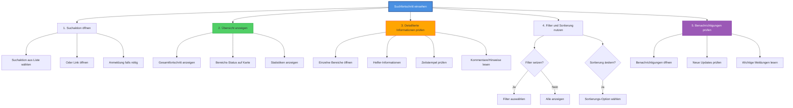

# HTA: Suchfortschritt einsehen

**Akteur:** Haustierbesitzer / Koordinator / Helfer  
**Kontext:** Während aktiver Suchaktion, Status-Überprüfung  
**Version:** 1.0  
**Datum:** 2025-01-26

---

## Aufgaben-Hierarchie

---

## Detaillierte Schritte

### 1. Suchaktion öffnen
- **1.1** FindMyPet-App/Website öffnen
- **1.2** Suchaktion finden
  - Aus "Meine Suchaktionen" Liste
  - Oder über Suche/Filter
  - Oder direkter Link
- **1.3** Anmeldung falls nötig
  - Login falls abgemeldet
  - Berechtigung prüfen (Leserecht)

### 2. Übersicht anzeigen
- **2.1** Gesamtfortschritt anzeigen
  - Fortschrittsbalken
  - Prozentanzeige
  - Anzahl durchsuchter Bereiche
- **2.2** Bereichs-Status auf Karte
  - **Grün:** Durchsucht
  - **Gelb:** In Bearbeitung
  - **Rot:** Hoch priorisiert, noch nicht durchsucht
  - **Grau:** Niedrig priorisiert
  - **Blau:** Zugewiesen, noch nicht begonnen
- **2.3** Statistiken anzeigen
  - Anzahl aktiver Helfer
  - Gesamtfläche durchsucht
  - Suchdauer
  - Letzte Aktivität

### 3. Detaillierte Informationen prüfen

#### Einzelne Bereiche:
- **3.1** Bereich auf Karte anklicken
  - Oder aus Liste auswählen
- **3.2** Bereichs-Details öffnen
  - Name/Bezeichnung
  - Priorität
  - Beschreibung
- **3.3** Status-Informationen
  - Durchsucht: Ja/Nein
  - Durchsucht von: (Helfer-Name)
  - Durchsucht am: (Datum/Zeit)
  - Dauer der Suche

#### Helfer-Informationen:
- **3.4** Helfer-Liste öffnen
  - Alle aktiven Helfer
  - Zugewiesene Bereiche
- **3.5** Helfer-Details
  - Name (falls nicht anonym)
  - Aktivität
  - Durchsuchte Bereiche
  - Gesamte Suchzeit

#### Zeitstempel:
- **3.6** Zeitstempel prüfen
  - Wann wurde Bereich durchsucht?
  - Wann wurde letzte Aktualisierung gemacht?
  - Wann wurde Suchaktion erstellt?

#### Kommentare/Hinweise:
- **3.7** Kommentare lesen
  - Hinweise von Helfern
  - Beobachtungen
  - Updates zur Suche

### 4. Filter und Sortierung nutzen

#### Filter:
- **4.1** Filter-Optionen öffnen
  - Button "Filter" klicken
- **4.2** Filter auswählen
  - **Status:** Nur durchsuchte / Nicht durchsuchte / Alle
  - **Priorität:** Hoch / Mittel / Niedrig / Alle
  - **Helfer:** Nach zugewiesenem Helfer filtern
  - **Datum:** Zeitraum auswählen
- **4.3** Filter anwenden
  - "Anwenden" klicken
  - Liste/Karte wird gefiltert

#### Sortierung:
- **4.4** Sortierungs-Option öffnen
  - Dropdown-Menü
- **4.5** Sortierung wählen
  - **Priorität:** Hoch zuerst
  - **Datum:** Neueste zuerst
  - **Status:** Nicht durchsuchte zuerst
  - **Name:** Alphabetisch
- **4.6** Sortierung anwenden
  - Automatisch angewendet

### 5. Benachrichtigungen prüfen
- **5.1** Benachrichtigungen öffnen
  - Bell-Icon klicken
  - Oder Benachrichtigungs-Bereich
- **5.2** Neue Updates prüfen
  - Ungelesene Benachrichtigungen
  - Neueste zuerst
- **5.3** Wichtige Meldungen lesen
  - Bereich wurde durchsucht
  - Neuer Helfer beigetreten
  - Fundmeldung eingegangen
  - Wichtige Updates
- **5.4** Benachrichtigung als gelesen markieren
  - Einzelne markieren
  - Oder alle als gelesen

---

## Anzeige-Optionen

| Ansicht | Beschreibung | Verwendung |
|---------|--------------|------------|
| **Kartenansicht** | Übersicht auf Karte | Geografische Übersicht |
| **Listenansicht** | Tabellarische Liste | Detaillierte Informationen |
| **Statistik-Ansicht** | Grafiken und Zahlen | Zahlenmäßige Übersicht |
| **Timeline** | Chronologische Ansicht | Ablauf der Suche |

---

## Fortschritts-Indikatoren

- **Gesamtfortschritt:**
  - Fortschrittsbalken
  - Prozentanzeige
  - "X von Y Bereichen durchsucht"
  
- **Bereichs-Fortschritt:**
  - Farbcodierung auf Karte
  - Status-Icons
  - Zeitstempel
  
- **Helfer-Fortschritt:**
  - Anzahl zugewiesener Bereiche
  - Anzahl durchsuchter Bereiche
  - Aktivitäts-Indikator

---

## Best Practices

✅ **Regelmäßig prüfen:** Status öfter kontrollieren  
✅ **Filter nutzen:** Relevante Informationen schnell finden  
✅ **Benachrichtigungen aktivieren:** Updates nicht verpassen  
✅ **Kartenansicht nutzen:** Geografischen Überblick behalten  
✅ **Details prüfen:** Detaillierte Informationen bei Bedarf einsehen

---

## Fehlerbehandlung

| Fehler | Ursache | Lösung |
|--------|---------|--------|
| Suchaktion nicht gefunden | Falsche Suche | Filter zurücksetzen |
| Daten werden nicht aktualisiert | Cache-Problem | Seite neu laden |
| Karte lädt nicht | Internet-Problem | Verbindung prüfen |
| Benachrichtigungen fehlen | Einstellungen | Benachrichtigungen aktivieren |

---

## Varianten

- **Schnelle Übersicht:** Nur Karte, minimale Details
- **Detaillierte Ansicht:** Alle Informationen einsehen
- **Vergleich:** Fortschritt über Zeit vergleichen
- **Export:** Fortschritt als PDF/Report exportieren

---

## Zeitschätzung

- **Schnelle Übersicht:** 30 Sekunden - 1 Minute
- **Detaillierte Prüfung:** 3-5 Minuten
- **Vollständige Analyse:** 10-15 Minuten