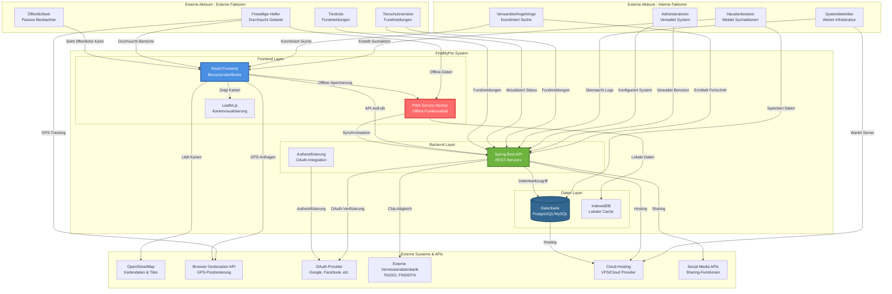
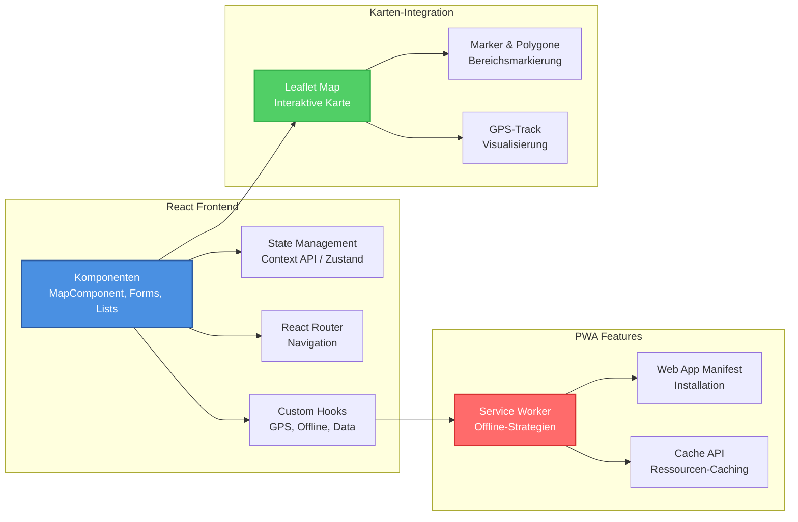
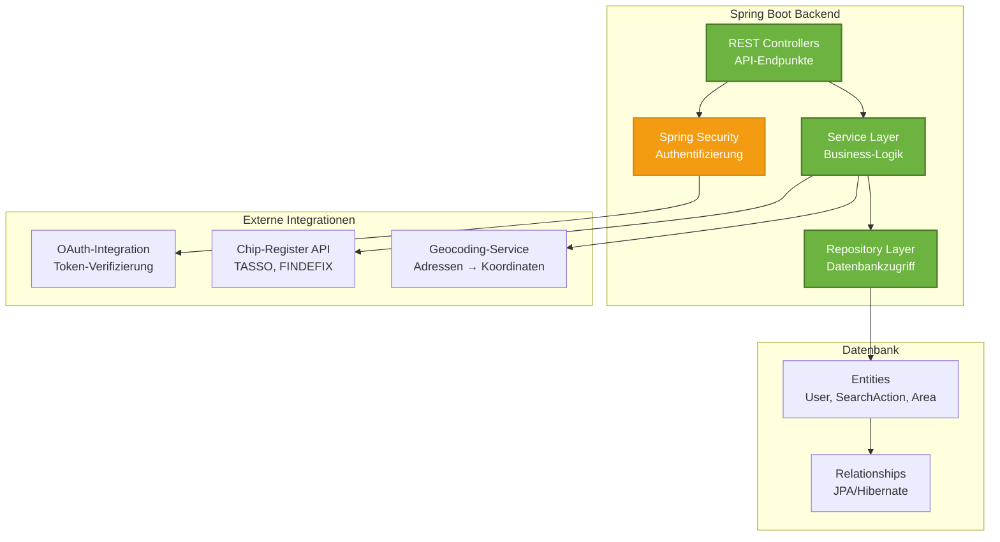
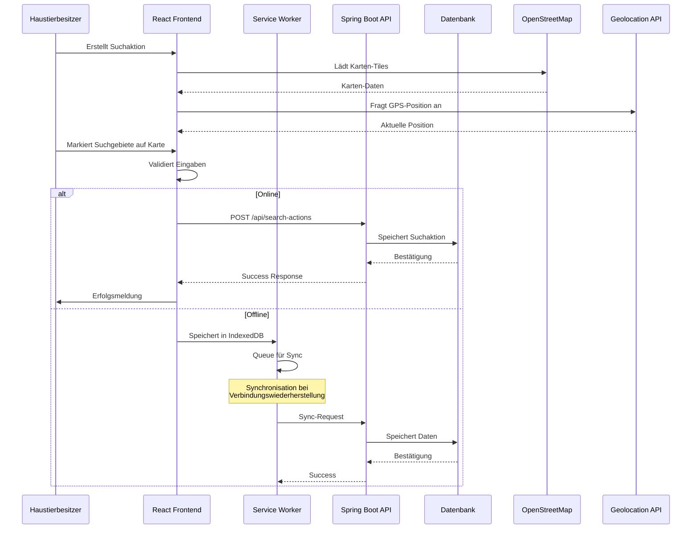
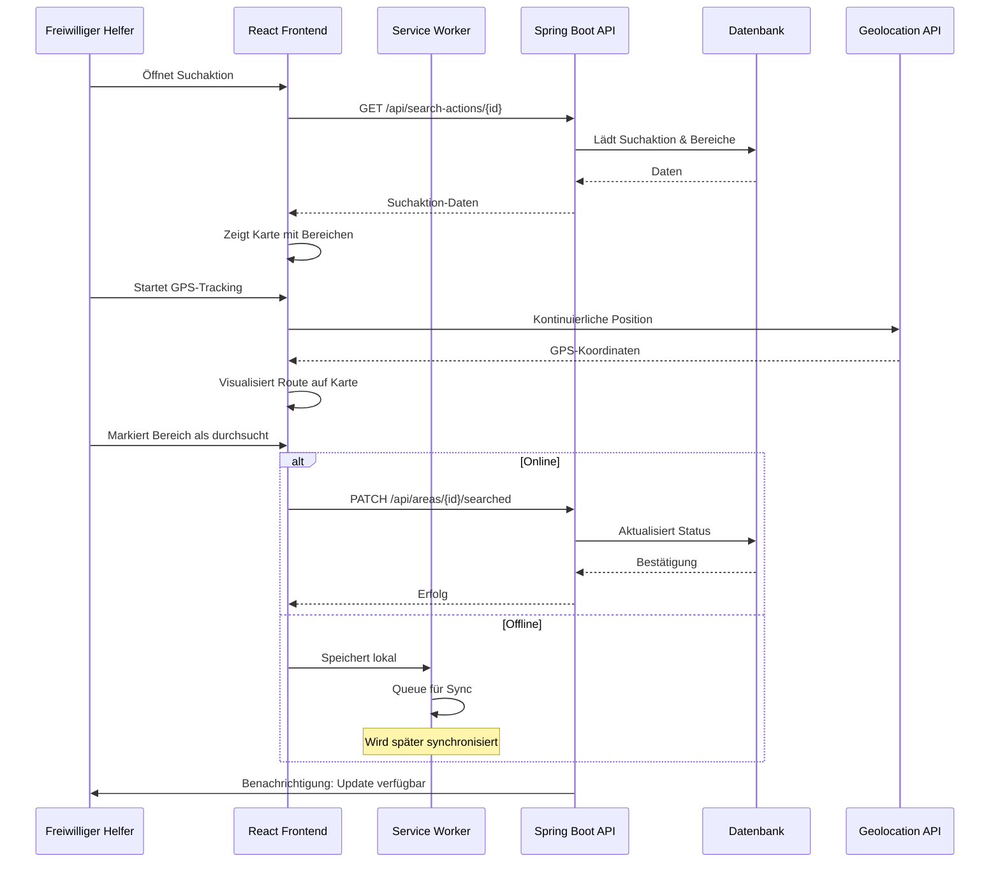
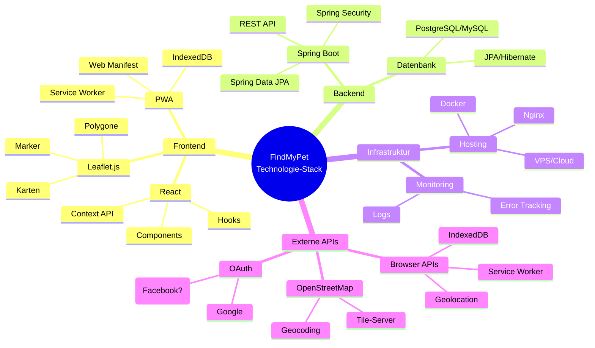
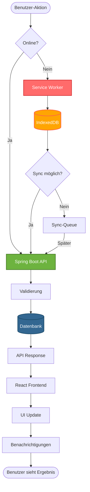
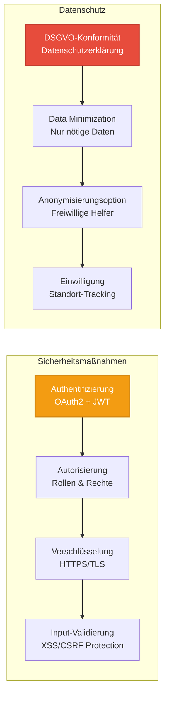

# Systemkontext FindMyPet V2.0

**Version:** 2.0  
**Datum:** 2025-01-26  
**Status:** Detailliert & Verbessert

---

## Überblick

Das FindMyPet-System ist eine web-basierte Plattform zur Koordination von Suchaktionen für vermisste Haustiere. Die Anwendung ermöglicht es Tierbesitzern, Suchgebiete zu markieren, und Freiwilligen, ihre durchsuchten Bereiche zu erfassen und zu koordinieren.

## Systemkontext-Diagramm

### Hauptansicht: System und externe Akteure

## Detaillierte Komponentenansicht

### Frontend-Architektur

### Backend-Architektur

## Datenfluss-Diagramm

### Hauptfunktion: Suchaktion erstellen und Bereich markieren

### Hauptfunktion: Freiwilliger sucht Gebiete

## Akteur-Verbindungsmatrix

### Interne Akteure (Projekt-interne)

| Akteur | Interaktion mit System | Hauptfunktionen | Technologie-Zugriff |
|--------|----------------------|-----------------|---------------------|
| **Haustierbesitzer** | React Frontend | • Suchaktion erstellen • Bereiche markieren • Fortschritt einsehen • Fotos hochladen | Browser, PWA |
| **Verwandte/Angehörige** | React Frontend | • Suchaktion verwalten • Bereiche zuweisen • Koordination | Browser, PWA |
| **Administratoren** | Spring Boot API | • Benutzer verwalten • Rollen & Rechte • Content-Moderation | Admin-Interface, API |
| **Systembetreiber** | Infrastruktur | • Server-Wartung • Monitoring • Backups | SSH, Cloud-Console |

### Externe Akteure (Community)

| Akteur | Interaktion mit System | Hauptfunktionen | Zugriff |
|--------|----------------------|-----------------|---------|
| **Freiwillige Helfer** | React Frontend (PWA) | • Suchgebiete sehen • GPS-Tracking aktivieren • Bereiche markieren (online/offline) • Updates erhalten | Browser, Mobile |
| **Tierschutzvereine** | Spring Boot API | • Fundmeldungen • Suchaktionen abrufen • Matching-Algorithmus | API, Dashboard |
| **Tierärzte** | Spring Boot API | • Fundmeldungen • Chip-Scanner-Integration | API |
| **Öffentlichkeit** | React Frontend | • Öffentliche Karte einsehen • Passives Beobachten | Browser (read-only) |

### Externe Systeme

| System | Funktion | Integration | Technologie |
|--------|----------|-------------|-------------|
| **OpenStreetMap** | Karten-Daten & Tiles | Leaflet.js Integration | REST API, Tile-Server |
| **Browser Geolocation API** | GPS-Positionierung | Native Browser API | HTML5 Geolocation |
| **OAuth-Provider** | Authentifizierung | Spring Security OAuth2 | OAuth2, JWT |
| **Externe Vermisstendatenbank** | Chip-Abgleich | REST API Integration | TASSO API, FINDEFIX API |
| **Cloud-Hosting** | Infrastruktur | Deployment | VPS, Docker, Nginx |
| **Social Media APIs** | Sharing-Funktionen | Optional Integration | Facebook API, Twitter API |

## Technologie-Stack Übersicht

---

## System-Grenzen und Verantwortlichkeiten

### FindMyPet System ist verantwortlich für

✅ **Suchaktions-Management**
- Erstellung und Verwaltung von Suchaktionen
- Bereichsmarkierung und Zuweisung
- Fortschritts-Tracking

✅ **GPS-Tracking & Offline-Funktionalität**
- Kontinuierliche GPS-Erfassung
- Offline-Datenspeicherung
- Synchronisation bei Verbindungswiederherstellung

✅ **Benutzer-Authentifizierung & Autorisierung**
- Benutzer-Registrierung
- Rollen & Rechte-Management
- OAuth-Integration

✅ **Daten-Management**
- Persistierung von Suchaktionen, Bereichen, Benutzern
- Datensicherheit & DSGVO-Konformität
- Backup & Wiederherstellung

### FindMyPet System ist NICHT verantwortlich für

❌ **Kartendaten-Erstellung** (OpenStreetMap)  
❌ **GPS-Hardware** (Browser/Device)  
❌ **OAuth-Provider-Betrieb** (Google, Facebook, etc.)  
❌ **Infrastruktur-Betrieb** (Cloud-Provider)  
❌ **Chip-Register-Datenbanken** (TASSO, FINDEFIX)

## Datenfluss-Übersicht

---

## Sicherheits- und Datenschutz-Aspekte

---

## Erweiterungen & Zukünftige Integrationen

### Mögliche zukünftige Erweiterungen

- **Push-Benachrichtigungen** (Web Push API)
- **E-Mail-Benachrichtigungen** (SMTP-Service)
- **SMS-Benachrichtigungen** (Twilio API)
- **Social Media Integration** (Facebook, Twitter Sharing)
- **KI-basierte Matching** (Bilderkennung für Fundtiere)
- **Mobile Apps** (React Native als Erweiterung der PWA)

## Vergleich zur V1.0

### Verbesserungen in V2.0

✅ **Detailliertere Komponentendarstellung** - Frontend, Backend und Datenbank-Layer klar getrennt  
✅ **Datenfluss-Diagramme** - Sequence Diagrams zeigen konkrete Interaktionen  
✅ **Technologie-Details** - Konkrete Technologien (React, Spring Boot, Leaflet.js) explizit genannt  
✅ **Akteur-Matrix** - Übersichtliche Tabelle aller Akteure und deren Funktionen  
✅ **Sicherheits-Aspekte** - Datenschutz und Sicherheit dokumentiert  
✅ **Offline-Funktionalität** - Service Worker und IndexedDB Integration klar dargestellt  
✅ **Multiple Views** - Verschiedene Diagramm-Typen für verschiedene Perspektiven  
✅ **Intuitivere Struktur** - Bessere Gruppierung und farbliche Kennzeichnung

## Anmerkungen

- Dieses Dokument verwendet **Mermaid-Diagramme** für die Visualisierung
- Für die Anzeige wird ein Mermaid-fähiger Markdown-Viewer benötigt (z.B. Typora, GitHub, GitLab)
- Die Diagramme können in verschiedene Formate exportiert werden (SVG, PNG)
- Bei Änderungen am System sollte dieses Dokument aktualisiert werden

---

**Erstellt von:** Team Axt · Moujtahid · Havertz  
**Letzte Aktualisierung:** 2025-12-28